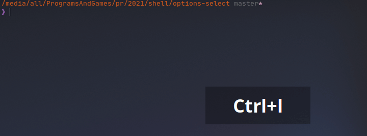

# Options Select
> _An interactive cross-platform select menu for BASH & ZSH with no dependencies._
## Install

Either [source] the script or install it directly into preferred `/bin` directory.

For Debian based systems install into the `~/.local/bin/`
(replace the link with current repo one):
```bash
curl https://raw.githubusercontent.com/hinell/options-select-bash/master/options.select.bash -o ~/.local/bin/options.select.bash && chmod +x ~/.local/bin/options.select.bash

```

[source]: https://tldp.org/HOWTO/Bash-Prompt-HOWTO/x237.html


### Auto install
Use the following script to automatically install the `options.select` on request.
Once installed, you can follow steps described above.

<details>

```bash
declare scriptURL="https://raw.githubusercontent.com/hinell/options-select-bash/master/options.select.bash";
declare scriptInstallPath="$HOME/.local/bin/options.select.bash";
[[ -s "$scriptInstallPath" ]] && return 0; # already installed;

echo -e "\e[;38;2;255;200;0mThis script requires external options.select.\n"\
"You want to automatically install it? (y=continue, Enter=abort\e[0m)"\

read YESNO
[[ "$YESNO" == 'y'  ]] || {
    echo "Aborting... See for more info https://github.com/hinell/options-select-bash.git";
    return -1;
};
curl $scriptURL -o "$scriptInstallPath";

chmod +x "$scriptInstallPath";

```
</details>

### Uninstall

```bash
$ rm ~/.local/bin/options.select.bash
```

## Usage
### Importing
The following script imports `options-select` and lists options so you can choose them. It also sets up a custom prompt. The output can be read from the respective variables. These variables aren't available if script is invoked from prompt.

```bash
# src/myscript.bash
. options-select.bash

# Input
options=(one two three);
prompt="Please, select choice! [%index]/[%total]";

# Selection
# Options var is passed without dollar sign
options.select options $prompt;

# The output
echo "INDEX        => $?"
echo "INDEX        => $SELECTED_IDX"
echo "SELECTED     => $SELECTED" # <- Selected value
```
### CLI

```bash
./options.select.bash --version        # print version
./options.select.bash from foo bar baz # select 3 opts; the 'from" is a command

```

### Keyboard controls
| Key | Description |
|-|-|
| <kbd>🠉</kbd> | Mover cursor up |
| <kbd>🠋</kbd> | Mover cursor down |
| <kbd>Enter</kbd> | Select entry (`SELECTED` is set, see above), index is returned |
| <kbd>CTRL+C</kbd> | Abort and return `-1` |

### Examples
Run `./examples.bash` file from the termian to see the script in action.

## Support status
No guarantee, support or maintanance until paid.

### Platforms

Terminals:
* Bash - 5.1.4
* Zsh - 5.8 

Operating systems:
* Ubuntu 21.04
* Kubuntu 21.04

## How it works? 
It relies heavily on ANSI and Terminal Emulation Software escape codes. It was written over a course of 7 days and under huge load of coffee cups 🍵. You are welcome to tip me off you like.

### Credits 
* Huge respect goes to [Alexander K.] on StackOverflow who inspired this script.

## See also
* [inquirer.js] - Terminal user interface written in JS for NodeJS
* [survey] - Similar, but written in Go
* `man console_codes`
* `man terminfo`

A collection of common interactive command line user interfaces. 

[Alexander K.]: https://unix.stackexchange.com/questions/146570/arrow-key-enter-menu/415155
[inquirer.js]: https://github.com/SBoudrias/Inquirer.js
[survey]: https://github.com/AlecAivazis/survey

----
 Copyright (C) 2021- hinel@github.com